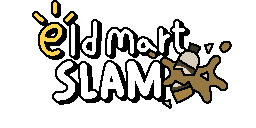
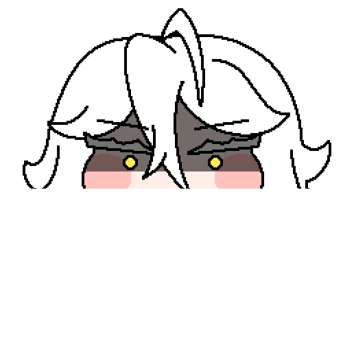

# 

## Eld Mart Slam - Indonesian Localization (Project Coffee SDK 7)

Proyek ini adalah pelokalan bahasa Indonesia yang komprehensif untuk game **Eld Mart Slam**, dibangun menggunakan engine **mata_SDK 7**. Seluruh teks, aset, dan mekanisme telah dioptimalkan untuk pengalaman bermain yang lebih baik bagi pemain lokal.

---

### 🔥 Fitur Unggulan: Fever Mode
Kita telah menambahkan dan menstabilkan mekanik **Fever Mode** yang membuat gameplay semakin intens:
- **Omni-Break**: Saat Fever aktif, tombol apa saja (Kiri/Kanan/Bawah) bisa menghancurkan barang!
- **Double Points**: Dapatkan skor ganda (20 poin) setiap kali menghancurkan rak di mode Fever.
- **NPC Perk**: Menendang NPC akan memberikan bonus **+5 poin** ke bar Fever Meter.
- **BGM Booster**: Musik (BGM) otomatis dipercepat ke **1.2x** saat Fever aktif untuk memacu adrenalin.
- **Visual Effect**: Efek getaran layar (*screen shake*) dan *red tint* pada karakter ED saat dalam kondisi "panas".

---

### 🛠️ Perubahan Teknis Utama
1.  **Indonesian Localization**: Terjemahan lengkap UI, intro, dan pesan error menggunakan sistem XML dinamis.
2.  **Language Selector**: Dukungan multi-bahasa (Indonesia, Inggris, Korea) yang tersimpan permanen di pengaturan.
3.  **Stability Fix**: Perbaikan bug *circular dependency* dan missing includes pada variabel global SDK.
4.  **Optimized Repository**: Ukuran repo telah diperkecil secara signifikan dengan pembersihan riwayat file sampah berukuran raksasa.

---

### 🚀 Cara Menjalankan & Build
Detail teknis mengenai cara build manual menggunakan MSBuild dan konfigurasi lingkungan pengembang dapat ditemukan di:
👉 **[GEMINI.md](GEMINI.md)**

---

### ⚠️ Catatan Kontributor (Post-Cleanup)
Karena riwayat Git telah di-*rewrite* untuk pembersihan, kontributor harus melakukan sinkronisasi ulang:
```bash
git fetch origin
git reset --hard origin/main
```

---

### 📜 Lisensi & Hak Cipta
- **Karakter & Aset**: Milik **EPIDGames** (Fan-made project).
- **Engine Asli**: `mata_SDK` dikembangkan oleh **mata0319**.
- **Versi Original**: Mainkan versi aslinya di **[itch.io](https://mata-studio.itch.io/eld-mart-slam)**.
- **Modifikasi AI**: Proyek ini dikembangkan dan dirawat dengan bantuan **Gemini CLI (AI Agent)**.

<p align="center">
  
</p>
